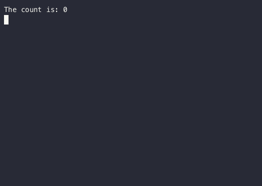

# Mosaic

An experimental tool for building console UI in Kotlin using the Jetpack Compose compiler/runtime.
Inspired by [Ink](https://github.com/vadimdemedes/ink).


Jump to:
[Introduction](#Introduction) |
[Usage](#Usage) |
[Samples](#Samples) |
[FAQ](#FAQ) |
[License](#License)


## Introduction

The entrypoint to Mosaic is the `runMosaic` function.
The lambda passed to this function is responsible for both output and performing work.

Output (for now) happens through the `setContent` function.
You can call `setContent` multiple times, but as you'll see you probably won't need to.

```kotlin
suspend fun main() = runMosaic {
  setContent {
    Text("The count is: 0")
  }
}
```

To change the output dynamically we can use local properties to hold state.
Let's update our counter to actually count to 20.

```kotlin
suspend fun main() = runMosaic {
  var count = 0

  setContent {
    Text("The count is: $count")
  }

  for (i in 1..20) {
    delay(250)
    count = i
  }
}
```

**This will not work!** Our count stays at 0 for 5 seconds instead of incrementing until 20.
Instead, we have to use Compose's `State` objects to hold state.

```diff
-var count = 0
+var count by mutableIntStateOf(0)
```

Now, when the `count` value is updated, Compose will know that it needs to re-render the string.

```kotlin
suspend fun main() = runMosaic {
  var count by mutableIntStateOf(0)

  setContent {
    Text("The count is: $count")
  }

  for (i in 1..20) {
    delay(250)
    count = i
  }
}
```

(Note: You may need to add imports for `androidx.compose.runtime.getValue` and `import androidx.compose.runtime.setValue` manually.)



That is the most basic sample of Mosaic.
From there, the limit is only your imagination.


_(Note: graphs in the above have rendering problems due to asciinema/agg which do not appear in the real output)_

## Usage

Mosaic is a library for Compose, and it relies on JetBrains' Kotlin Compose plugin to be present for use.
Any module which wants to call `runMosaic` or define `@Composable` functions for use with Mosaic must have this plugin applied.
For more information, see [the JetBrains Compose compiler documentation](https://www.jetbrains.com/help/kotlin-multiplatform-dev/compose-compiler.html).

Mosaic itself can then be added like any other dependency:

```groovy
dependencies {
  implementation("com.jakewharton.mosaic:mosaic-runtime:0.13.0")
}
```

Documentation is available at [jakewharton.github.io/mosaic/docs/0.x/](https://jakewharton.github.io/mosaic/docs/0.x/).

<details>
<summary>Snapshots of the development version are available in Sonatype's snapshots repository.</summary>
<p>

```groovy
repository {
  mavenCentral()
  maven {
    url 'https://oss.sonatype.org/content/repositories/snapshots/'
  }
}
dependencies {
  implementation("com.jakewharton.mosaic:mosaic-runtime:0.14.0-SNAPSHOT")
}
```

Snapshot documentation is available at [jakewharton.github.io/mosaic/docs/latest/](https://jakewharton.github.io/mosaic/docs/latest/).

</p>
</details>


## Samples

Run `./gradlew installDist` to build the sample binaries.

 * [Counter](samples/counter): A simple increasing number from 0 until 20.

   `./samples/counter/build/install/counter/bin/counter`

 * [Demo](samples/demo): A playground for demonstrating many features of Mosaic.

   `./samples/demo/build/install/demo/bin/demo`

 * [Jest](samples/jest): Example output of a test framework (such as JS's 'Jest').

   `./samples/jest/build/install/jest/bin/jest`

 * [Robot](samples/robot): An interactive, game-like program with keyboard control.

   `./samples/robot/build/install/robot/bin/robot`

 * [rrtop](samples/rrtop): An example inspired by [rrtop](https://github.com/wojciech-zurek/rrtop).

   `./samples/rrtop/build/install/rrtop/bin/rrtop`


## FAQ

### I thought Jetpack Compose was a UI toolkit for Android?

Compose is, at its core, a general-purpose runtime and compiler for tree and property manipulation
which is trapped inside the AndroidX monorepo and under the Jetpack marketing department. This
core can be used for _any_ tree on _any_ platform supported by Kotlin. It's an amazing piece of
technology.

Compose UI is the new UI toolkit for Android (and maybe [Desktop](https://www.jetbrains.com/lp/compose/)?).
The lack of differentiation between these two technologies has unfortunately caused Compose UI to
overshadow the core under the single "Compose" moniker in an unforced marketing error.

If you want another example of a non-Compose UI-based Compose project checkout JetBrains' [Compose for Web](https://blog.jetbrains.com/kotlin/2021/05/technology-preview-jetpack-compose-for-web/) project.

### Output repeats with `./gradlew run` and/or inside IntelliJ IDEA

Running within Gradle or IntelliJ IDEA will not work. Both tools strip ANSI control characters,
which prevent Mosaic from redrawing over a previous frame. The output will likely just render in
successive lines instead.

In the future Mosaic will detect this case and do... something. For now, we unconditionally emit
ANSI control characters. Run your programs directly in a terminal emulator–no IDE and no Gradle.

### Why doesn't work take place in a `LaunchedEffect`?

This is the goal. It is currently blocked by [issuetracker.google.com/178904648](https://issuetracker.google.com/178904648).

When that change lands, and Mosaic is updated, the counter sample will look like this:
```kotlin
suspend fun main() = runMosaic {
  var count by remember { mutableIntStateOf(0) }

  Text("The count is: $count")

  LaunchedEffect(Unit) {
    for (i in 1..20) {
      delay(250)
      count = i
    }
  }
}
```

# License

    Copyright 2020 Jake Wharton

    Licensed under the Apache License, Version 2.0 (the "License");
    you may not use this file except in compliance with the License.
    You may obtain a copy of the License at

       http://www.apache.org/licenses/LICENSE-2.0

    Unless required by applicable law or agreed to in writing, software
    distributed under the License is distributed on an "AS IS" BASIS,
    WITHOUT WARRANTIES OR CONDITIONS OF ANY KIND, either express or implied.
    See the License for the specific language governing permissions and
    limitations under the License.
