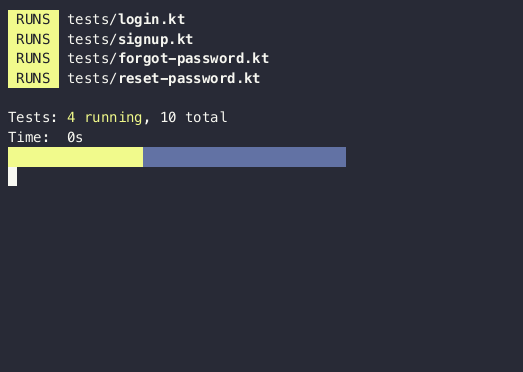
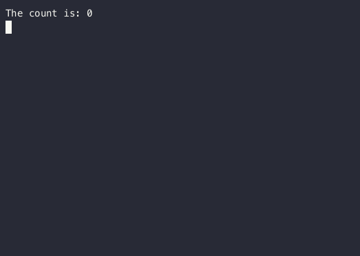

# Mosaic

An experimental tool for building console UI in Kotlin using the Jetpack Compose compiler/runtime.
Inspired by [Ink](https://github.com/vadimdemedes/ink).



Jump to:
[Introduction](#Introduction) |
[Usage](#Usage) |
[Samples](#Samples) |
[FAQ](#FAQ) |
[License](#License)


## Introduction

The entrypoint to Mosaic is the `runMosaic` function.
The lambda passed to this function is responsible for both output and performing work.

```kotlin
suspend fun main() = runMosaic {
  Text("The count is: 0")
}
```

To change the output dynamically we can use local properties to hold state.
Let's update our counter to actually count to 20.

```kotlin
suspend fun main() = runMosaic {
  var count by remember { mutableIntStateOf(0) }

  Text("The count is: $count")

  LaunchedEffect(Unit) {
    for (i in 1..20) {
      delay(250)
      count = i
    }
  }
}
```

(Note: You may need to add imports for `androidx.compose.runtime.getValue` and `import androidx.compose.runtime.setValue` manually.)



That is the most basic sample of Mosaic.
From there, the limit is only your imagination.


_(Note: graphs in the above have rendering problems due to asciinema/agg which do not appear in the real output)_

## Usage

Mosaic is a library for Compose, and it relies on JetBrains' Kotlin Compose plugin to be present for use.
Any module which wants to call `runMosaic` or define `@Composable` functions for use with Mosaic must have this plugin applied.
For more information, see [the JetBrains Compose compiler documentation](https://www.jetbrains.com/help/kotlin-multiplatform-dev/compose-compiler.html).

Mosaic itself can then be added like any other dependency:

```groovy
dependencies {
  implementation("com.jakewharton.mosaic:mosaic-runtime:0.18.0")
}
```

Documentation is available at [jakewharton.github.io/mosaic/docs/0.x/](https://jakewharton.github.io/mosaic/docs/0.x/).

<details>
<summary>Snapshots of the development version are available in the Central Portal Snapshots repository.</summary>
<p>

```groovy
repository {
  mavenCentral()
  maven {
    url 'https://central.sonatype.com/repository/maven-snapshots/'
  }
}
dependencies {
  implementation("com.jakewharton.mosaic:mosaic-runtime:0.19.0-SNAPSHOT")
}
```

Snapshot documentation is available at [jakewharton.github.io/mosaic/docs/latest/](https://jakewharton.github.io/mosaic/docs/latest/).

</p>
</details>


## Samples

Run `./gradlew installDist` to build the sample binaries.

 * [Counter](samples/counter): A simple increasing number from 0 until 20.

   `./samples/counter/build/install/counter/bin/counter`

 * [Demo](samples/demo): A playground for demonstrating many features of Mosaic.

   `./samples/demo/build/install/demo/bin/demo`

 * [Jest](samples/jest): Example output of a test framework (such as JS's 'Jest').

   `./samples/jest/build/install/jest/bin/jest`

 * [Robot](samples/robot): An interactive, game-like program with keyboard control.

   `./samples/robot/build/install/robot/bin/robot`

 * [rrtop](samples/rrtop): An example inspired by [rrtop](https://github.com/wojciech-zurek/rrtop).

   `./samples/rrtop/build/install/rrtop/bin/rrtop`

 * [snake](samples/snake): Snake game.

   `./samples/snake/build/install/snake/bin/snake`

## FAQ

### I thought Compose was a UI toolkit for Android?

Compose is, at its core, a general-purpose compiler and runtime to do state tracking and tree node
and property manipulation. This can be used on any platform supported by Kotlin for any kind of
state or with any tree. It's an amazing piece of technology.

Compose UI is the modern UI toolkit for Android which also runs on the desktop, iOS, and the web.
The lack of differentiation between these two technologies has unfortunately caused Compose UI to
overshadow the core under the single "Compose" moniker in an unforced marketing error.

Other examples of non-Compose UI-based Compose projects are Cash App's Redwood,
JetBrains' Compose HTML, or Google's Jetpack Glance.

### Broken output with `./gradlew run` and/or inside IntelliJ IDEA

Running within Gradle or IntelliJ IDEA will not work. These tools do not provide access to the TTY
in order to be interactive. And for non-interactive programs, both will strip ANSI control
characters which prevent Mosaic from redrawing over a previous frame. The output will likely just
render in successive lines instead.

Run your programs directly in a terminal emulator–no IDE and no Gradle.


# License

    Copyright 2020 Jake Wharton

    Licensed under the Apache License, Version 2.0 (the "License");
    you may not use this file except in compliance with the License.
    You may obtain a copy of the License at

       http://www.apache.org/licenses/LICENSE-2.0

    Unless required by applicable law or agreed to in writing, software
    distributed under the License is distributed on an "AS IS" BASIS,
    WITHOUT WARRANTIES OR CONDITIONS OF ANY KIND, either express or implied.
    See the License for the specific language governing permissions and
    limitations under the License.
